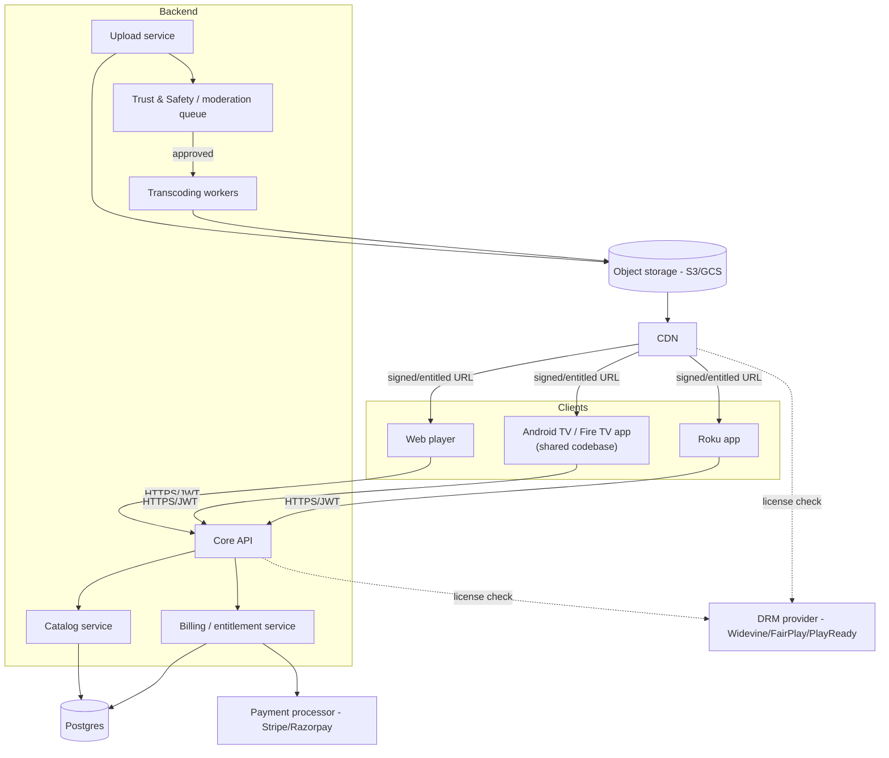
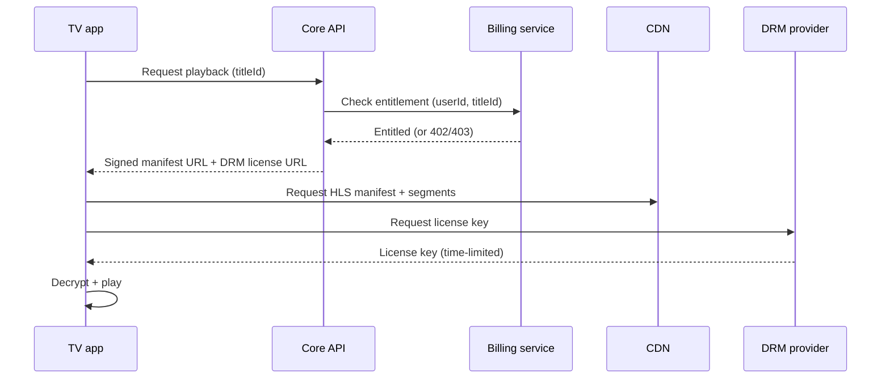
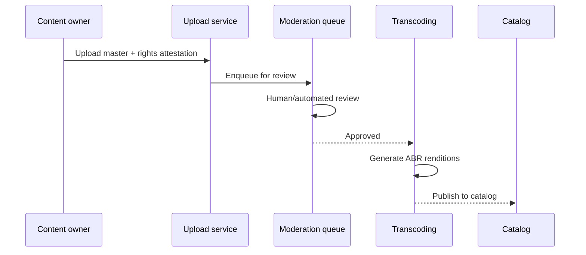

# ARCHITECTURE — System Structure
**Project:** StreamHub

## 1. High-level component diagram

## 2. Components
| Component | Responsibility |
|---|---|
| **Core API** | Auth, entitlement checks, routes clients to catalog/billing services |
| **Upload service** | Accepts large files (resumable upload), captures rights attestation (`PRD.md` §6.2), stores raw master |
| **Trust & Safety / moderation queue** | Every upload sits here until approved (or auto-approved under a defined policy) before transcoding runs — this is the enforcement point for `PRD.md` §2 |
| **Transcoding workers** | FFmpeg-based pipeline, master → multiple adaptive-bitrate HLS renditions |
| **Catalog service** | Titles, series/season/episode structure, search |
| **Billing/entitlement service** | Subscription plans, payment integration, issues short-lived playback entitlements |
| **DRM provider** | Third-party managed service (not built in-house) — issues license keys for protected playback |
| **CDN** | Serves video segments; playback URLs are signed and entitlement-checked, not public/guessable |

## 3. Playback request flow

## 4. Upload → publish flow

No path exists from Upload directly to Catalog that skips the moderation queue — this is intentional, not an oversight to "optimize away."

## 5. TV app architecture note
Android TV and Fire TV share a single Kotlin/ExoPlayer (Media3) codebase and can largely share a build target; Roku requires a fully separate codebase (BrightScript/SceneGraph) since it's a different platform entirely. Both hit the same Core API — no platform-specific backend logic.

## 6. Why DRM is not optional for licensed content
If any content falls under `PRD.md` §2 bucket 2 (licensed third-party content), the license agreement itself will almost certainly require DRM, geo-restriction, and concurrent-stream limits as contractual terms — this isn't an engineering nice-to-have, it's what makes the license valid to sign in the first place. See `DECISIONS.md`.
