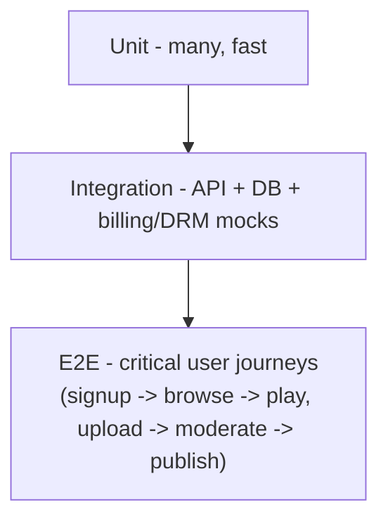

# TESTING — Quality Checks
**Project:** StreamHub

## 1. Test pyramid

## 2. Playback-specific QA (the highest-risk surface)
- **Adaptive bitrate correctness:** verify quality switches happen appropriately under simulated bandwidth throttling, across web and each TV platform.
- **Resume position accuracy:** playback resumes within ~2 seconds of last watched position across devices (test switching devices mid-title too — resume state should sync via account, not just local storage).
- **DRM license acquisition:** licensed content fails closed (no playback) if a license can't be acquired — never silently falls back to unprotected playback.
- **Entitlement enforcement:** a user without an active subscription/entitlement cannot obtain a valid playback URL even with a known title ID — test this as a security case, not just a UI case (attempt direct API calls, not just "does the Play button show").
- **Captions/subtitles:** render correctly and stay in sync across at least one long-form (2h+) title per platform.

## 3. TV-specific QA
- **D-pad-only navigation:** every screen fully reachable and operable with no pointer/touch input, on real hardware for each platform (emulators miss real remote-input latency and focus-engine quirks).
- **Focus animation performance:** no dropped frames/jank on lower-powered TV hardware (test on an actual low-end/older TV box, not just a flagship device).
- **Cold start time:** app reaches an interactive home screen within each platform's certification-required time budget (Roku and Fire TV both have explicit store requirements here — check current guidelines before each release).
- **Remote back-button behavior:** matches each platform's expected navigation conventions (this is a common certification rejection reason).

## 4. Billing & entitlement
- Subscribe → immediate entitlement → playback works, end to end.
- Cancel → entitlement correctly expires at the right billing-cycle boundary (not instantly, unless that's the defined policy — confirm expected behavior explicitly, don't assume).
- Failed payment → correct downgrade/grace-period behavior, not an abrupt silent playback failure.
- Test with the payment processor's official sandbox/test-mode cards, never real payment credentials in CI.

## 5. Upload & moderation pipeline
- Upload without completing rights attestation is blocked, and this is tested as a required-path test, not just a UI validation nicety (`PRD.md` §2, `ARCHITECTURE.md` §4).
- Content cannot reach the public catalog via any path that bypasses the moderation queue — write this as an explicit integration test, since it's the single most important invariant in the system.
- Takedown request → content removed from catalog and CDN cache invalidated within the SLA defined in `PRD.md` §7.

## 6. Load & scale
- Load-test concurrent stream counts against realistic peak scenarios (e.g. a popular title's release night) before launch, not after.
- CDN cache hit-rate monitored; cold-cache playback-start latency measured separately from warm-cache.

## 7. Definition of "tested enough" to merge
Every task (`AGENTS.md`/`RULES.md`) needs unit tests for new logic, an integration test if it touches a new API endpoint, and — if it touches playback, billing, DRM, or the moderation pipeline — an explicit test proving the relevant invariant from §2–§5 above still holds.
